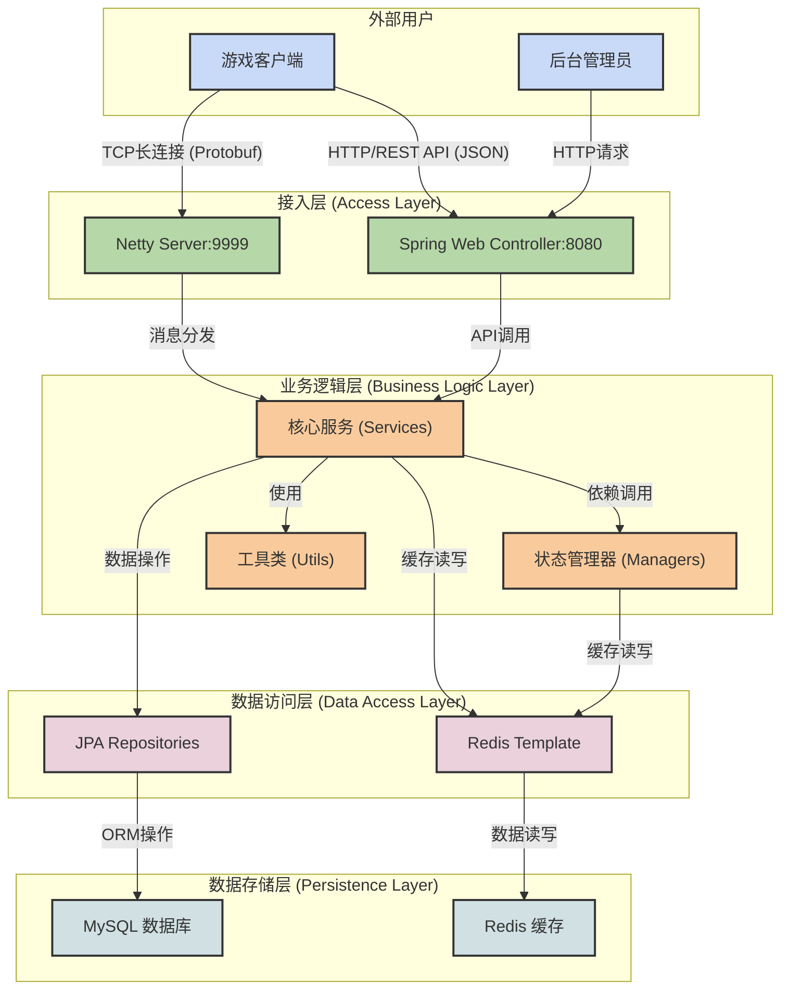
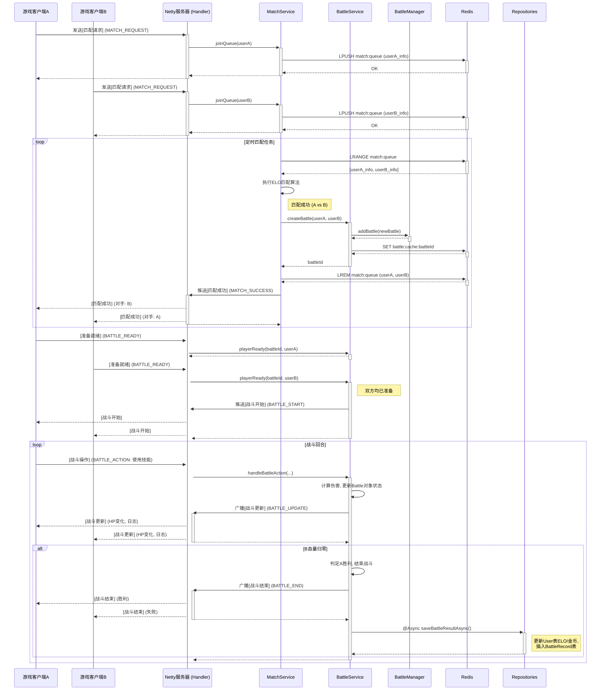
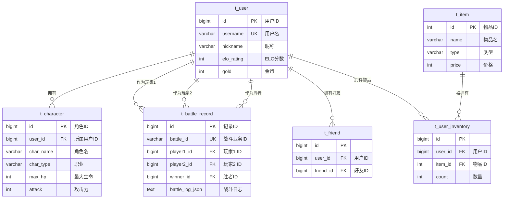

# TurnBasedGame-Server

本项目是一个基于 **SpringBoot 4.0.1** 和 **Netty** 构建的高性能、可扩展的回合制在线游戏服务端。它采用现代化的后端技术栈和清晰的分层架构，旨在为游戏提供稳定、低延迟的核心业务支持，并为开发者提供一份结构清晰、易于维护和二次开发的样板工程。

该项目不仅实现了游戏的核心功能，也包含了完整的后台管理系统。

## 核心特性

-   **TCP/HTTP 双协议栈架构**:
    -   **HTTP (Spring Web)**: 负责处理无状态业务，如用户注册、登录认证（JWT）、后台管理界面（Thymeleaf）、排行榜查询等RESTful API。
    -   **TCP (Netty)**: 负责处理核心游戏逻辑，通过长连接实现低延迟的实时交互，如匹配撮合、战斗指令同步、心跳检测等。

-   **高性能网络通信**:
    -   **Netty**: 基于NIO的异步事件驱动网络框架，提供高吞吐量和强大的并发处理能力。
    -   **Protobuf (Protocol Buffers)**: 采用Google的二进制序列化方案，相比JSON/XML，数据更小、解析更快，有效降低网络带宽消耗和CPU开销。

-   **动态化战斗逻辑 (热更新)**:
    -   **Lua 脚本引擎 (LuaJ)**: 核心战斗公式（如伤害、治疗、闪避计算）由外部Lua脚本定义。这使得开发和运营人员可以在**不重启服务器**的情况下，通过后台管理界面**热更新**战斗数值和逻辑，极大地提高了版本迭代和平衡性调整的灵活性。
    -   **Java 兜底机制**: 当Lua脚本执行失败或语法错误时，系统会自动降级至Java硬编码的保底公式，确保了核心服务的**高可用性**。

-   **多级缓存与状态管理**:
    -   **Redis**: 作为核心的内存数据存储，承担多种角色：
        -   **匹配队列**: 使用Redis `List`结构实现公平的先进先出(FIFO)匹配池。
        -   **实时战斗状态缓存**: 正在进行的战斗对象被序列化后存入Redis，TTL为30分钟，用于**断线重连**时快速恢复战斗现场。
        -   **临时战报**: 战斗结束后，完整的战斗快照在Redis中缓存7天，供玩家近期查看。
    -   **JVM 内存缓存**:
        -   **`BattleManager`**: 在内存中维护所有活跃战斗的索引，实现毫秒级访问。
        -   **`SessionManager`**: 维护用户ID与Netty Channel的映射关系，实现向指定玩家的定向消息推送。

-   **持久化与数据访问**:
    -   **MySQL**: 作为主数据库，存储所有需要永久保存的核心数据，如用户信息、角色、道具、好友关系以及完整的历史战斗记录。
    -   **Spring Data JPA**: 提供强大的ORM能力，简化了数据库的CRUD操作，并通过`Repository`模式将数据访问逻辑与业务逻辑解耦。

-   **异步任务处理**:
    -   通过Spring的 `@Async` 注解，将战斗结束后的数据归档（如更新ELO、写入战报到MySQL）等耗时操作放入独立的线程池执行，避免阻塞Netty的I/O线程，保障了主游戏循环的流畅性。

-   **完备的后台管理系统**:
    -   基于 **Thymeleaf** 服务端渲染技术，提供了一个功能丰富的后台管理界面，包括：数据看板、用户管理（封禁/解封）、历史战报查询与筛选、Lua脚本在线编辑与热更新、系统缓存刷新等。

## 系统架构

本系统采用经典的三层架构模型，并通过双协议栈设计将实时与非实时业务分离。



-   **接入层**: 负责协议解析与请求路由。`Netty Server`处理Protobuf格式的TCP流，`Spring Controller`处理HTTP请求。
-   **业务逻辑层**: 系统的核心。`Service`层负责编排业务流程（如一场完整的战斗），`Manager`层负责管理运行时状态（如在线玩家、进行中的战斗）。
-   **数据访问层**: 负责与底层数据源交互。`Repository`通过JPA操作MySQL，`RedisTemplate`操作Redis。
-   **数据存储层**: 负责数据的持久化与缓存。MySQL存储永久性数据，Redis存储热点数据和临时状态。

## 技术选型

| 技术栈                     | 名称                                     | 主要作用                                                                                             |
| -------------------------- | --------------------------------------- | ---------------------------------------------------------------------------------------------------- |
| **核心框架**               | Spring Boot                             | 快速构建、配置和运行独立的Java应用，整合了整个技术生态。                                             |
| **网络通信**               | Netty                                   | 提供高性能、异步事件驱动的NIO网络框架，用于构建TCP长连接服务。                                       |
| **Web服务**                | Spring Web (Tomcat)                     | 提供RESTful API接口和后台管理页面的HTTP服务。                                                        |
| **数据库**                 | MySQL                                   | 关系型数据库，用于持久化存储用户、角色、战报等核心业务数据。                                         |
| **数据访问**               | Spring Data JPA / Hibernate             | ORM框架，简化数据库操作，实现面向对象的持久化编程。                                                  |
| **缓存**                   | Redis / Spring Data Redis               | 高性能内存数据库，用于匹配队列、战斗状态缓存、断线重连数据等场景。                                   |
| **序列化**                 | Protobuf                                | 高效的二进制序列化协议，用于Netty客户端与服务端之间的通信，性能优于JSON。                              |
| **认证与安全**             | JWT (jjwt) / Spring Security Crypto     | 使用JWT实现无状态认证，BCrypt算法对用户密码进行哈希加密存储。                                        |
| **脚本引擎**               | LuaJ                                    | 轻量级Java版Lua解释器，用于动态执行战斗伤害公式，实现热更新。                                        |
| **后台模板引擎**           | Thymeleaf                               | 服务端Java模板引擎，与Spring Boot深度集成，用于渲染后台管理页面。                                    |
| **构建工具**               | Maven                                   | 项目管理和构建自动化工具。                                                                           |

## 项目结构

```
src/main/java/com/game/fwork
├── config/              # Spring Boot 配置类 (Redis, Netty, 异步线程池等)
├── controller/          # Spring MVC 控制器 (处理HTTP请求)
│   ├── AdminController.java   # 后台管理页面逻辑
│   └── AuthController.java    # 注册、登录认证API
├── dto/                 # 数据传输对象 (Data Transfer Objects)
│   └── MatchQueueItem.java  # 匹配队列元素
├── entity/              # JPA实体类 (对应数据库表)
│   ├── User.java
│   ├── Battle.java          # (非JPA) 运行时战斗对象
│   └── BattleRecord.java    # (JPA) 持久化的战斗记录
├── enums/               # 自定义枚举
│   └── BattleState.java
├── manager/             # 状态管理器 (管理内存中的运行时数据)
│   ├── BattleManager.java   # 管理所有进行中的战斗
│   ├── SessionManager.java  # 管理用户ID与Netty Channel的映射
│   └── LuaEngineManager.java# Lua脚本引擎封装
├── netty/               # Netty相关实现
│   ├── NettyServer.java     # Netty服务器启动与配置
│   └── handler/
│       └── GameServerHandler.java # 核心业务消息处理器
├── proto/               # (编译生成) Protobuf的Java类
├── repository/          # Spring Data JPA 仓库接口
├── service/             # 核心业务逻辑服务
│   ├── BattleService.java   # 战斗生命周期管理
│   ├── MatchService.java    # 玩家匹配逻辑
│   └── ScheduledTasks.java  # 定时任务 (超时检测等)
└── util/                # 工具类
    ├── JwtUtil.java
    └── DamageCalculator.java # 伤害计算器(Lua+Java)
```

## 核心业务流程

### 1. 玩家匹配至战斗结束

下图展示了从玩家发起匹配到战斗结束的完整时序。



## 数据库设计 (ER图)

数据库设计遵循第三范式，核心围绕`用户(t_user)`、`角色(t_character)`和`战斗记录(t_battle_record)`三张表展开。



## 环境配置与启动

### 前置依赖

-   **JDK 21** 或更高版本
-   **Maven 3.8** 或更高版本
-   **MySQL 8.0** 或更高版本
-   **Redis 6.0** 或更高版本

### A1. 配置（不使用Docker，且放弃SSL通讯）

1.  **数据库配置**:
    -   在MySQL中创建一个名为 `turn_based_game` 的数据库。
    -   打开 `src/main/resources/application.properties` 文件。
    -   修改以下数据库连接信息：
        ```properties
        spring.datasource.url=jdbc:mysql://localhost:3306/turn_based_game?....
        spring.datasource.username=your_mysql_username
        spring.datasource.password=your_mysql_password
        ```

2.  **Redis配置**:
    -   确保Redis服务正在运行。
    -   在 `application.properties` 中修改Redis连接信息：
        ```properties
        spring.data.redis.host=your_redis_host
        spring.data.redis.port=your_redis_port
        spring.data.redis.password=your_redis_password
        ```

3.  **JWT密钥**:
    -   **重要**: 为了安全，请务必修改JWT密钥。在 `application.properties` 中：
        ```properties
        # 生成一个复杂的随机字符串替换默认值
        jwt.secret=your-super-secret-key-that-is-long-and-random
        ```

### A2. 运行

1.  **初始化数据库**:
    -   首次运行时，你可以配置 `spring.jpa.hibernate.ddl-auto=update`（默认为 `validate` ），JPA/Hibernate会自动根据`@Entity`类创建所有数据表。
    -   为了填充初始数据（如管理员账号、技能模板等），请手动执行项目根目录下的 `init.sql` 脚本，建议在首次执行项目前先执行SQL脚本。

2.  **关闭Netty PROXY Protocol 解码**:
    -   打开 `application.properties` 后将 `netty.server.use-proxy-protocol` 切换为 `false`（默认为 `true` ）。 

3.  **启动应用**:
    -   **通过IDE**: 直接运行 `GameApplication.java` 的 `main` 方法。
    -   **通过Maven**: 在项目根目录下执行命令：
        ```bash
        mvn spring-boot:run
        ```

4.  **验证**:
    -   **HTTP服务**: 浏览器访问 `http://localhost:8080/admin`，应能看到后台登录页面。
    -   **Netty服务**: 服务端控制台会打印 `Netty服务器启动成功！监听端口: 9999`。此时，如果游戏客户端启用了HTTP连接，便可以连接到 `localhost:9999`。

### B. 编译与部署（使用Docker，且使用SSL通讯）

1.  **SSL配置**:
-   **生成证书**: 将私钥与证书命名为server.*（文件扩展名）后在项目根目录创建 `cert` 文件夹，并将文件放入其中，没有私钥可选择从提供商（如`Let's Encrypt`）处获得，也可以自行通过OpenSSH生成，可供参考的生成指令如下：
    ```bash
    openssl req -x509 -nodes -days 365 -newkey rsa:2048 -keyout server.key -out server.crt
    ```

2.  **配置Docker Compose文件**:
-   **自定义（可选）**: 可以按需修改字段（如修改 `SPRING_DATASOURCE_PASSWORD` 来更改访问数据库所使用的密码）或增减将要部署的容器（如注释部署MySQL容器的部分，选择使用自己的数据库容器）
-   **安全性（生产环境下必须完成）**: 
  - 修改JWT密钥：
      ```properties
      # 生成一个复杂的随机字符串替换默认值
      JWT_SECRET=your-super-secret-key-that-is-long-and-random
      ```
    

3.  **编译、封装、运行**:
-   **执行Docker Compose**: 在项目根目录下执行命令实现自动化部署：
    ```bash
    docker compose up --build -d
    ```
    PS：在没修改代码的情况下再次运行Compose就可以去掉`--build`

4.  **验证**:
    -   **HTTP服务**: 浏览器访问 `https://（您的部署机器的IP或URL）/admin`，应能看到后台登录页面。
    -   **Netty服务**: 容器日志会打印 `Netty服务器启动成功！监听端口: 9999`。此时，游戏客户端可以连接到机器的 `9999` 端口。